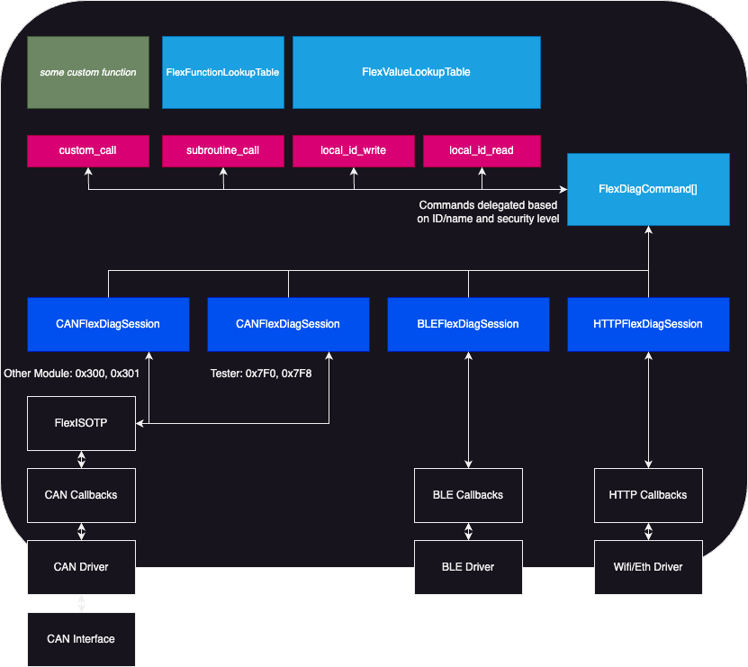

# FlexDiag
FlexDiag is a modular C library designed to make implementing automotive-style diagnostic/control sessions across various communication protocols a breeze. With no dynamic memory allocation, it provides a robust, developer-friendly framework to handle variable lookups, function call tables, security level authorization, and communication encoding just once—then scale it across as many concurrent diagnostic sessions as needed.

# 🚀 Key Features
- **Concurrent Sessions:** Support multiple independent diagnostic sessions effortlessly.
- **Custom Security Levels:** Per-session user-managed security levels for access control. Keep it at 0 for unrestricted access or define thresholds for specific actions.
- **Lookup Tables:** Map internal variables of any size by ID or name for seamless read and write operations.
- **Function Tables:** Map functions by ID or name, with support for parameterized calls.
- **Default Responses:** Built-in handling for "not found" and "access denied" errors.
- **Protocol Integration:** Seamlessly works with the FlexISOTP library for CAN+UDS sessions.
- **Versatile Protocol Support:** Includes basic implementations for UDS, HTTP, BLE, and Serial communication.
- **Non-intrustive Scope:** Designed to only operate as a utility so developers can maintain full control of communication behavior/peripherals for other purposes.

# 🎯 Goals
- Enable multi-protocol diagnostics: from CAN+UDS to BLE and HTTP.
- Deliver a lightweight framework for handling diagnostics across platforms.
- Simplify the process of sharing functionality between protocols while maintaining flexibility for protocol-specific extensions.

## 📖 Use Cases
- Automotive Diagnostics: Support both standard UDS diagnostics and modern BLE/Wi-Fi connections in one solution.
- Concurrent Sessions: Allow both tester diagnostic sessions and private sessions for infotainment or configuration changes.
- Cross-Protocol Simplicity: Share common calls between BLE and Wi-Fi with extended features available for high-throughput Wi-Fi.
- Unified Communication Formats: Maintain the same communication format across Serial, BLE, and other supported protocols.

## ⚠️ Expectations
- This library is not designed for extra high-bandwidth use. While BLE, HTTP, and Serial will certainly have more throughput and can be used concurrently, this is basically intended to be an enumerable version of UDS that works on more than just CAN.

## 🏗️ Project Structure
